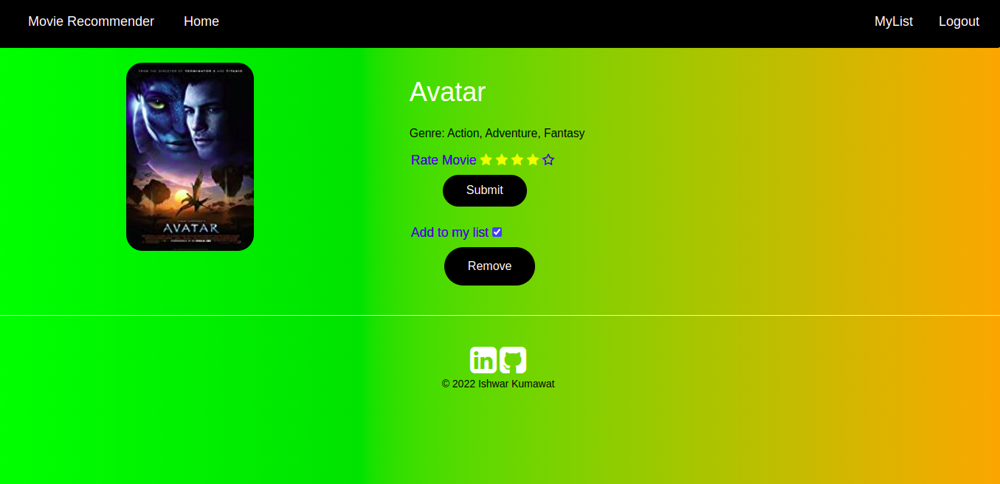

# Django based movie recommender system


### Website Preview
#### Home Page


#### Detail Page


#### my list 


#### login page 


#### signup page 


----

## Installation 📦

>pip install -r requirements.txt

#### Clone

- Clone this repo to your local machine.

#### virtual environment

- use conda virtual environment


#### Run server locally

```shell
$ python manage.py runserver
```
> Go to localhost:8000

---
## Features 📋
* User can register and login.
* User can search through various movies and look through its details.
* User can give rating to the movies.
* User can add movie to their watch list.
* User can get movie recommendation (Recommendation algorithm (Collaborative Filtering) which suggests new movies based on the ratings given by user.)
---

## Algorithm
##### Collabortive Filtering (Recommender Algorithm)
* Collaborative filtering filters information by using the interactions and data collected by the system from other users. It's based on the idea that people who agreed in their evaluation of certain items are likely to agree again in the future.
* When we want to find a new movie to watch we'll often ask our friends for recommendations. Naturally, we have greater trust in the recommendations from friends who share tastes similar to our own.
* Collaborative-filtering systems focus on the relationship between users and items. The similarity of items is determined by the similarity of the ratings of those items by the users who have rated both items.
* There are two types of collaborative filtering
    * **User-based**, which measures the similarity between target users and other users.
    * **Item-based**, which measures the similarity between the items that target users rate or interact with and other items.
    > I have used **user based** collaborative filtering in this project.
     
     
                                                                                                                                                                                                                                                  
